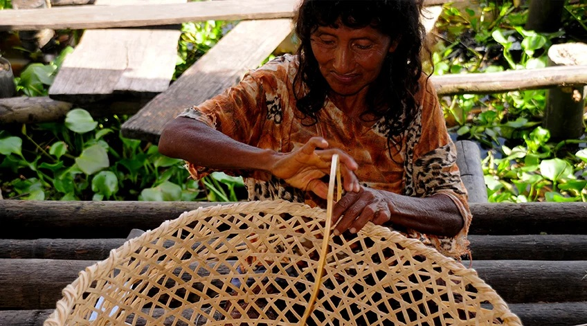

# Guía de Contribución

Gracias por tu interés en mejorar este proyecto educativo sobre Delta Amacuro. Esta guía te ayudará a contribuir de manera efectiva.

## Cómo Contribuir

### 1. Correcciones de Contenido

Si encuentras información incorrecta o desactualizada:

1. Identifica la sección que necesita corrección
2. Verifica la información con fuentes confiables
3. Haz los cambios en el archivo `index.html`
4. Incluye las fuentes en un comentario

**Ejemplo:**
```html
<!-- Fuente: Wikipedia - Estado Delta Amacuro (2026) -->
<p>Delta Amacuro tiene una extensión de 40,200 km²...</p>
```

### 2. Mejoras de Diseño

Para mejorar el aspecto visual:

- Modifica `styles.css` para cambios de estilo
- Mantén la coherencia con los colores actuales:
  - Verde oscuro: `#004d40` (primary-dark)
  - Verde medio: `#00796b` (primary)
  - Azul: `#1e88e5` (secondary)
  - Verde claro: `#66bb6a` (accent)

- Asegúrate de que los cambios sean responsivos (funcionen en móviles)

### 3. Agregar Contenido Nuevo

#### Agregar una nueva sección

1. Agrega el HTML en `index.html`:
```html
<section id="nueva-seccion" class="animate-on-scroll">
    <h2>Título de la Sección</h2>
    <p>Contenido...</p>
</section>
```

2. Si necesitas estilos específicos, agrégalos en `styles.css`

3. Prueba que las animaciones funcionen correctamente

#### Agregar imágenes

1. Guarda la imagen en la carpeta `images/`
2. Usa nombres descriptivos: `artesania-warao.jpg`
3. Optimiza las imágenes antes de subirlas (máx 500KB)
4. Usa formatos web: `.jpg` para fotos, `.png` para gráficos, `.svg` para logos

5. Referencia la imagen en el HTML:
```html

```

### 4. Mejoras de Accesibilidad

Ayuda a hacer el sitio más accesible:

- Verifica que todas las imágenes tengan atributos `alt` descriptivos
- Asegura contraste adecuado entre texto y fondo
- Usa etiquetas semánticas HTML5 correctamente
- Prueba la navegación con teclado

### 5. Optimización de Rendimiento

Para que el sitio cargue más rápido:

- Comprime imágenes sin perder calidad
- Minimiza CSS y JavaScript cuando sea necesario
- Usa formatos modernos de imagen (WebP para compatibilidad)

## Proceso de Contribución

### Si eres estudiante de la U.E. Juan Crisóstomo Falcón

1. Contacta al profesor encargado del proyecto
2. Solicita acceso al repositorio
3. Crea una rama para tus cambios:
   ```bash
   git checkout -b mejora-descripcion
   ```
4. Realiza tus cambios
5. Haz commit con mensajes descriptivos:
   ```bash
   git commit -m "Añadir información sobre artesanía Warao"
   ```
6. Sube tus cambios:
   ```bash
   git push origin mejora-descripcion
   ```
7. Crea un Pull Request explicando tus cambios

### Si eres de otra institución

1. Haz un Fork del repositorio
2. Crea una rama para tus cambios
3. Realiza los cambios
4. Envía un Pull Request con:
   - Descripción clara de los cambios
   - Por qué son necesarios
   - Fuentes de información (si aplica)

## Estándares de Código

### HTML

- Usa indentación de 4 espacios
- Cierra todas las etiquetas
- Usa etiquetas semánticas (`<section>`, `<article>`, `<nav>`)
- Mantén la estructura ordenada

### CSS

- Organiza por secciones con comentarios
- Usa variables CSS para colores
- Mantén la coherencia en nombres de clases
- Comenta código complejo

### JavaScript

- Usa nombres descriptivos de variables
- Comenta funciones complejas
- Mantén el código simple y legible

## Ideas para Contribuir

### Contenido

- [ ] Agregar más platos tradicionales Warao
- [ ] Incluir mitos y leyendas del Delta
- [ ] Ampliar información sobre flora del Delta
- [ ] Agregar sección de música tradicional
- [ ] Incluir entrevistas o testimonios de comunidades Warao

### Funcionalidad

- [ ] Agregar modo oscuro/claro
- [ ] Implementar sistema de idiomas (Español/Warao)
- [ ] Agregar mapa interactivo del Delta
- [ ] Crear galería de fotos expandible
- [ ] Agregar sección de recursos educativos descargables

### Diseño

- [ ] Crear animaciones más elaboradas
- [ ] Diseñar iconos personalizados para las secciones
- [ ] Mejorar la tipografía
- [ ] Agregar ilustraciones vectoriales del Delta

## Recursos Útiles

### Información sobre Delta Amacuro

- [Wikipedia - Estado Delta Amacuro](https://es.wikipedia.org/wiki/Estado_Delta_Amacuro)
- [Wataniba - Organización Socioambiental](https://watanibasocioambiental.org/)
- [Red Venezolana de OSC](https://acsinergia.org/)

### Herramientas de Desarrollo

- [MDN Web Docs](https://developer.mozilla.org/) - Documentación web
- [Can I Use](https://caniuse.com/) - Compatibilidad de navegadores
- [TinyPNG](https://tinypng.com/) - Compresión de imágenes
- [Google Fonts](https://fonts.google.com/) - Tipografías web

### Validadores

- [HTML Validator](https://validator.w3.org/)
- [CSS Validator](https://jigsaw.w3.org/css-validator/)
- [Lighthouse](https://developers.google.com/web/tools/lighthouse) - Auditoría de rendimiento

## Código de Conducta

Este es un proyecto educativo. Por favor:

- Sé respetuoso con otros contribuyentes
- Proporciona retroalimentación constructiva
- Mantén el foco en el objetivo educativo
- Respeta la cultura Warao en todo momento
- Verifica la información antes de publicarla

## Preguntas

Si tienes preguntas sobre cómo contribuir:

1. Revisa esta guía completa
2. Consulta el README.md
3. Contacta al equipo del proyecto
4. Crea un Issue en GitHub describiendo tu duda

---

¡Gracias por ayudar a preservar y compartir el conocimiento sobre Delta Amacuro!
