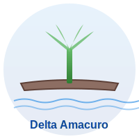

<p align="center">
  
</p>

<h1 align="center">Delta Amacuro - Donde el Orinoco se hace mar</h1>

<p align="center">
  <strong>Proyecto Educativo</strong><br>
  Unidad Educativa Juan Crisóstomo Falcón<br>
  Barcelona, Estado Anzoátegui, Venezuela
</p>

---

## Sobre el Proyecto

Landing page educativa interactiva que explora la riqueza cultural, geográfica y biológica del estado Delta Amacuro, Venezuela. Este proyecto forma parte de una iniciativa estudiantil para dar a conocer la cultura ancestral Warao y el ecosistema único del Delta del Orinoco.

La página está diseñada para ser accesible mediante código QR y desplegada en Railway, permitiendo un fácil acceso desde dispositivos móviles durante exposiciones y presentaciones escolares.

## Características

- Diseño responsive optimizado para móviles y tablets
- Animaciones suaves al hacer scroll
- Galería de imágenes interactiva con modal
- Contenido educativo sobre:
  - Geografía del Delta del Orinoco
  - Cultura del pueblo Warao
  - Gastronomía tradicional
  - Biodiversidad de la región
  - Patrimonio natural y cultural

## Tecnologías Utilizadas

- **HTML5** - Estructura semántica
- **CSS3** - Diseño responsivo y animaciones
- **JavaScript** - Interactividad y efectos
- **Docker** - Contenedorización para despliegue
- **Railway** - Hosting cloud

## Estructura del Proyecto

```
webqr/
├── index.html              # Página principal
├── styles.css              # Estilos y diseño responsivo
├── script.js               # Interactividad y animaciones
├── Dockerfile              # Configuración de contenedor
├── images/                 # Recursos visuales
│   ├── logo-warao.svg     # Logo del proyecto
│   └── qr-placeholder.svg # Placeholder para código QR
├── Expo Cultura-Delta Amacuro.docx  # Documentación de referencia
└── README.md               # Este archivo
```

## Instalación y Uso

### Visualización Local

1. Clona o descarga el repositorio
2. Abre `index.html` en tu navegador web preferido
3. No se requiere servidor web para visualización básica

### Despliegue en Railway

1. Crea una cuenta en [Railway.app](https://railway.app)
2. Conecta tu repositorio de GitHub
3. Railway detectará automáticamente el `Dockerfile` y desplegará la aplicación
4. Obtendrás una URL pública para compartir

### Usando Docker Localmente

```bash
# Construir la imagen
docker build -t delta-amacuro-web .

# Ejecutar el contenedor
docker run -p 8080:80 delta-amacuro-web

# Acceder en http://localhost:8080
```

## Contenido Educativo

### Delta Amacuro

Estado ubicado en el extremo oriental de Venezuela, con una extensión de 40,200 km² (4.6% del territorio nacional). Su principal característica es el Delta del Río Orinoco, que se divide en aproximadamente 60 caños y 40 ríos formando un laberinto acuático único en el mundo.

### Pueblo Warao

Los Warao ("gente de la canoa") son los habitantes ancestrales del delta, con presencia estimada de 8,000-9,000 años en la región. Su cultura está profundamente vinculada al agua, viviendo en palafitos y utilizando la canoa (curiara) como medio principal de transporte.

La palma de moriche es central en su cosmovisión, proporcionando alimento, fibra para artesanías y materiales de construcción.

### Biodiversidad

El Delta del Orinoco es uno de los ecosistemas mejor conservados de Venezuela, albergando:
- Más de 500 especies de aves
- Jaguares, manatíes, delfines de río
- Diversidad de peces y especies acuáticas
- Bosques de manglar y selvas tropicales
- Flora única adaptada a ambientes de agua dulce y salada

## Código QR

Una vez desplegada la aplicación:

1. Genera un código QR con la URL pública usando herramientas como:
   - [QR Code Generator](https://www.qr-code-generator.com/)
   - [QRCode Monkey](https://www.qrcode-monkey.com/)

2. Descarga el código QR generado

3. Reemplaza el placeholder en la página:
   ```html
   <!-- Cambiar esto: -->
   <div class="placeholder-image qr">QR</div>

   <!-- Por esto: -->
   
   ```

## Personalización

### Colores
Los colores principales se definen en `styles.css` usando variables CSS:
```css
:root {
  --primary-color: #1e88e5;
  --secondary-color: #66bb6a;
  --text-color: #333;
}
```

### Contenido
Todo el contenido educativo se encuentra en `index.html` y puede ser modificado según las necesidades del proyecto.

### Imágenes
Las imágenes actualmente se cargan desde URLs externas. Para mejor rendimiento, considera descargarlas y alojarlas en la carpeta `images/`.

## Contribuciones

Este es un proyecto educativo abierto a mejoras:
- Correcciones de contenido
- Mejoras de diseño
- Optimización de rendimiento
- Adición de más recursos educativos

## Créditos

**Proyecto desarrollado por estudiantes de:**
- Unidad Educativa Juan Crisóstomo Falcón
- Barcelona, Estado Anzoátegui, Venezuela

**Fuentes de información:**
- Wikipedia - Estado Delta Amacuro
- Wataniba - Organización socioambiental
- Red Venezolana de OSC
- Investigaciones académicas sobre cultura Warao

## Licencia

Proyecto educativo de uso libre para fines académicos y culturales.

---

<p align="center">
  <strong>Hecho con dedicación para preservar y compartir<br>el patrimonio cultural de Delta Amacuro</strong>
</p>
